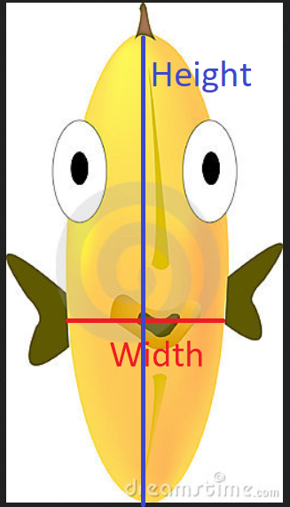
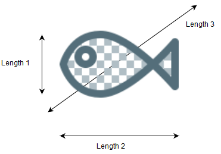

# Fish market(魚市常見資料)

## 簡介
+ 資料時間：2019
+ 資料來源：[Fish market | Kaggle](https://www.kaggle.com/datasets/aungpyaeap/fish-market?resource=download)
+ 授權方式： GPL 2

## 資料說明
### 欄位說明
+ **Species**：種類
    + 一共有7種
+ **Weight**：魚重
    + 以g為單位
    + 0~1650
+ **Length1**：側面寬度
    + vertical length in cm
    + 7.5~59.0
+ **Length2**：側面長度
    + diagonal length in cm
    + 8.4~63.4
+ **Length3**：側面對角線長度
    + cross length in cm
+ **Height**：正視高度
    + height in cm
+ **Width**：正視寬度
    + diagonal width in cm

> 關於為什麼會同時有五種長度：
> 
> 
> 詳見[原始討論](https://www.kaggle.com/datasets/aungpyaeap/fish-market/discussion/97243)或[原資料集說明文件](https://jse.amstat.org/datasets/fishcatch.txt)


### 資料描述
|        | Weight   | Length1  | Length2  | Length3  | Height   | Width    |
|--------|----------|----------|----------|----------|----------|----------|
| count  | 159.0    | 159.0    | 159.0    | 159.0    | 159.0    | 159.0    |
| mean   | 398.3    | 26.2     | 28.4     | 31.2     | 9.0      | 4.4      |
| std    | 358.0    | 10.0     | 10.7     | 11.6     | 4.3      | 1.7      |
| min    | 0.0      | 7.5      | 8.4      | 8.8      | 1.7      | 1.0      |
| 25%    | 120.0    | 19.1     | 21.0     | 23.2     | 5.9      | 3.4      |
| 50%    | 273.0    | 25.2     | 27.3     | 29.4     | 7.8      | 4.2      |
| 75%    | 650.0    | 32.7     | 35.5     | 39.7     | 12.4     | 5.6      |
| max    | 1650.0   | 59.0     | 63.4     | 68.0     | 19.0     | 8.1      |


## 資料讀取
```python
import pandas as pd
URL = r"https://raw.githubusercontent.com/Keycatowo/dataset/main/002-%E9%AD%9A%E5%B8%82%E5%B8%B8%E8%A6%8B%E8%B3%87%E6%96%99/Fish.csv"
df = pd.read_csv(URL, encoding= 'utf-8')
```